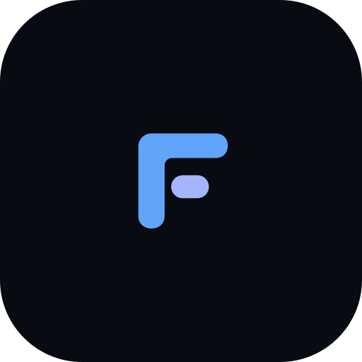

<p align="center">
  
</p>

<div align="center">

# Fluxon

</div>

<p align="center">
  OpenFlux-клиент для Android. Форк OpenFluxAndroid.
</p>

<p align="center">
  
  
  
</p>

---

## Преимущества форка

### 🔒 Продвинутая безопасность и маскировка
* **Сквозное AES-256-GCM шифрование:** Провайдер промежуточного сервиса видит только нечитаемый шум. Каждое направление (клиент → сервер и сервер → клиент) использует независимый производный ключ (`scrypt` + `HMAC-SHA256`).
* **Защита от атак повтора (Anti-Replay):** Уникальные 12-байтные nonces и скользящее окно недавних пакетов для предотвращения replay-атак.
* **Изолированное хранение ключей и приватность:** Гарантированное удаление ключевых файлов с диска при сбросе настроек, защита от утечки секретов через строковые дампы и полная очистка системных логов от чувствительных данных.

### 🌐 Сеть и DNS
* **Интегрированный DoT-клиент и DNS-кэшер:** Решает многолетнюю проблему мобильного Go-рантайма на современных Android (включая Android 14/15/16), маршрутизируя DNS-запросы через зашифрованный TLS (порт 853) к доверенным резолверам (Google, Cloudflare, Yandex) и локальный кэш `pdnsd`.
* **Выбор DNS-провайдера:** Поддержка DNS over HTTPS (DoH), DNS over TLS (DoT), системного DNS сети или ручной установки серверов.
* **Настройка MTU:** Тонкая подстройка MTU (1280–1500) с готовыми пресетами под сотовые вышки и IPv6 для стабильной работы без фрагментации пакетов (дефолт 1400).
* **Kill Switch:** Мгновенная блокировка трафика в обход туннеля при непредвиденном разрыве соединения.

### 🎯 Раздельное туннелирование (Split Tunneling)
* **По приложениям:** Выбирайте, какие приложения пускать через туннель, а какие оставлять в прямой сети («Обходить VPN» или «Только через VPN»), с удобным поиском по списку.
* **По доменам и сервисам:** Встроенные и пополняемые базы пресетов в один клик:
  * Российские сервисы (.ru, .рф, Госуслуги, банки, маркетплейсы — прямой доступ без VPN);
  * YouTube и Google Video;
  * Discord и голосовые каналы;
  * AI-сервисы (ChatGPT, Claude, Copilot, Midjourney);
  * Заблокированные ресурсы (АнтиЗапрет, Instagram, Twitter/X).

### 📡 Раздача интернета (Hotspot Proxy Bridge)
* **Превратите телефон в шлюз:** Автоматический запуск моста при подключении VPN для раздачи защищенного трафика на ноутбук, консоль или ТВ по Wi-Fi.
* **Бесшовное подключение:** Локальный порт SOCKS5 изолирован от внешнего LAN-порта (10808) во избежание конфликтов портов, а авторизация в локальной сети по умолчанию отключена, устраняя ошибки HTTP 407 на подключенных устройствах (с поддержкой RFC 1929 при необходимости).

### 🛠 Мониторинг и интерфейс
* **Информация о подключении:** Реальный замер сквозной задержки (ping) до выхода в интернет и скорость приема/отдачи прямо в постоянном уведомлении и на главном экране.
* **Быстрое управление (Quick Settings Tile):** Плитка в шторке быстрых настроек Android со стабильным управлением жизненным циклом нативного транспорта.
* **Журнал событий:** Кольцевой буфер до 1000 строк для фиксации событий раннего старта и экспорт логов с датой и временем (`fluxon_logs_yyyy-MM-dd_HH-mm-ss.txt`).
* **Импорт и экспорт без ограничений:** Распознавание QR-кодов прямо из скриншотов в галерее, экспорт настроек QR-изображением и поддержка ссылок `openflux://` и `fluxon://`.
* **Современный Material You UI:** Лаконичный темный дизайн без лишних элементов, поддержка динамических тематических иконок (Themed Icons для Android 13+) и выверенные отступы.

---

## Установка

Готовый APK доступен на странице [Releases](https://github.com/senopoleno/FluxonAndroid/releases).

Требуется Android 8.0 (API 26) или выше.  
Поддерживаемые архитектуры: `arm64-v8a`, `armeabi-v7a`, `x86_64`.

---

## Сборка

```bash
git clone https://github.com/senopoleno/FluxonAndroid.git
cd FluxonAndroid
./gradlew assembleRelease
```

Требования:
- JDK 17+ (JVM Toolchain 21)
- Android SDK (API 34, Build Tools 34.0.0)

Собранный файл автоматически копируется в корень проекта:
`Fluxon.apk` (или `app/build/outputs/apk/release/app-release.apk`)

---

## Лицензия

Проект создан исключительно в образовательных и исследовательских целях для тестирования протоколов устойчивости связи в нестабильных сетевых средах. Разработчики не несут ответственности за нецелевое использование ПО.

Проект создан исключительно в образовательных и исследовательских целях для тестирования протоколов устойчивости связи в нестабильных сетевых средах. Разработчики не несут ответственности за нецелевое использование ПО.  
Распространяется под лицензией GPLv3.
